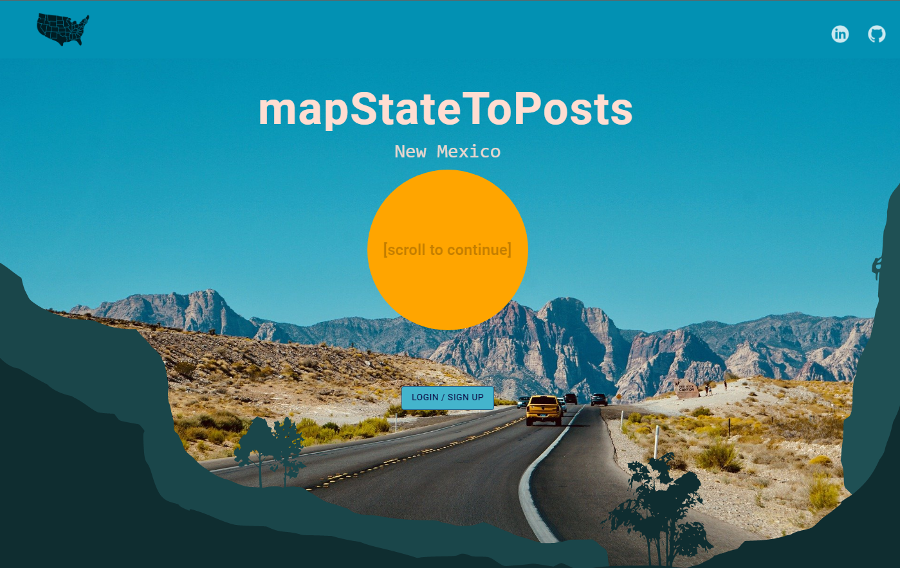

## Description

mapStatesToPosts is an original web app where users can upload a post (photo and caption) from every U.S. state they have visited, and view and comment on other user's posts.  The title is an insider developer's nod to the react-redux function `mapStateToProps`.

Inspired by the fact that people like to share about all the countries they have visited, we wondered how many U.S. states people have visited.  mapStatesToPosts gives users the opportunity to share a visual scrapbook of all of those destinations. 

Try it live [here!](https://mapstatestoposts.herokuapp.com/#/)

(click `Demo User` for quick access)



## Technologies, Libraries, APIs

- MongoDB for the database
- Mongoose for models and validations
- Express.js for HTTP routes / backend API
- React/Redux for creating interactive UI and managing state
- Node.js as a runtime environment to use JavaScript in-app
- JavaScript/Axios for frontend code
- CSS to style components rendered on the browser
- React-icons library for icons
- SVG for map rendering
- MUI library for design components
- Masonry for posts layout design
- AWS Simple Storage Service (S3) for uploading and hosting photos 
- Heroku to host the live site

## Features

With mapStatesToPosts users can:

- Signup / Signin to an account

- View a personalized map where each state they have visited and uploaded a post/photo for is highlighted

- Click on any state to view general information and a fun fact about that state and see all other user's posts associated with that state. There are also external links to more fun facts and travel/tourism information.

- View a personalized user's page with all of their posts for all states they have visited

- Create, read, edit, and delete a post with photo upload for a state they have visited (CRUD)

- Create, read, edit, and delete comments on other user's posts (CRUD)


## Coding Challenges

CHALLENGE: We took on the task of having a U.S. map that has highlighted states unique to each user.  Every state is by default not highlighted, and we originally only had one map, not one per user.  A user can create a post with a photo and once that is complete the state turns red to show that the user has been there, and their post also appears at the top of the posts on the main page.

SOLUTION: We begin by fetching all posts from the current user.  Next we map over those posts and extract the name of the state from each post, pushing the state name into an array variable, `states`.  However, we need an object rather than an array. We use `reduce` on the array of `states`, passing in `{}` as accumulator. We then iterate over the `states` array and key each state to `{fill: 'color'}`, get the object as `state : {fill: 'color'}` and return it to get the highlighted states for that user.

```javascript
statesFilling = () => {
    const { posts, currentUser} = this.props;
    
    let states = [];
    posts.map(post => {

      if (post.user === currentUser.id) {
      states.push(post.stateName)
      }
    })

    const res = states.reduce((acc, state) => {
       acc[state] = {
        fill: "#c8808c"
      };
      return acc;
    }, {})
    return res
  }
```

CHALLENGE: When using AWS and the MongoDB server to allow users to upload photos, we were able to successfully set up the AWS S3 hosting, but there were issues with the backend database not recognizing the photo object that we were trying to create.

SOLUTION: We discovered that in order to send the file to the server to be saved, we had to instantiate a new `FormData` object. We then used the `append` method to add key/values to send to the server. One of the key/value pairs is the binary file we grab from `this.state.file`, and the uploaded photo exists at the `files[0]` in the `<input>`tag. We also had to be mindful to have our keys match whatever our our backend controller is expecting in the params. In our case this is `post['photo']`.

```javascript
handleSubmit(e) {
    e.preventDefault();
    const formData = new FormData();

    formData.append('caption', this.state.caption);
    formData.append('stateName', this.state.stateName);


    if (this.state.photo){
      formData.append('photo', this.state.photo);
    }

    this.props.createPost(formData).then(this.props.closeModal());
  }

<label>Image</label>
        <input 
                className="image"
                type="file"
                onChange={e => this.setState({ photo: e.target.files[0] })}
        />
```

## Future Implementations

- Users can post details on their user profile page about upcoming trips to new states
- On the user's map the user's uploaded photo for a state is transformed into the actual shape of that state and displayed on the map
